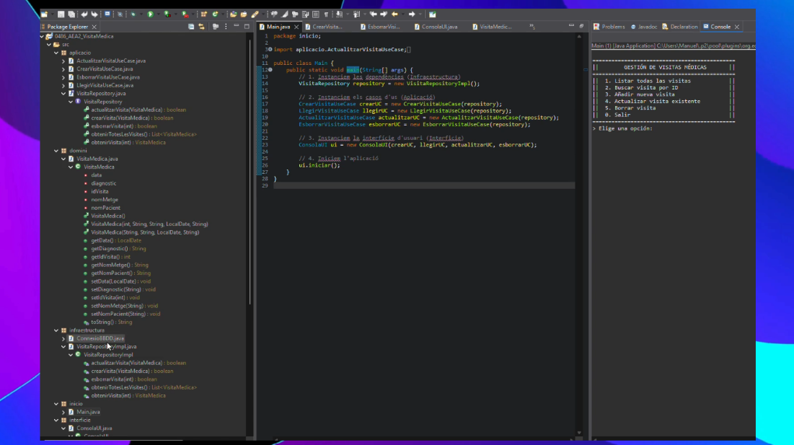

# Prat.Dam.C2526.0486.ACD.P01.Jdbc

Esta es la Práctica Evaluación 2 del Módulo de Acceso a datos (0486) sobre programación de bases de datos relacionales en el lenguaje Java mediante el controlador **JDBC**.

## Contenido de la Entrega

Este repositorio incluye el desarrollo de la aplicación (`VisitaMédica`) desarrollada en Java y la interacción a base de datos externa.

## Estructura del Proyecto

* `0486_AEA2_VisitaMedica/` - Carpeta raíz del proyecto de Java que incluye la infraestructura (`ConnexioBBDD`) y las interfaces de usuario por consola (`ConsolaUI`).
* `crear_base_datos.sql` - Script SQL para generar/restaurar la base de datos de origen en MySQL o MariaDB.
* Resto de recursos y clases requeridas por el enunciado original.

## Ejecución y Pruebas
1. Ejecutar el script SQL (`crear_base_datos.sql`) en un gestor compatible (DBeaver, MySQL Workbench, etc).
2. Asegurar que las credenciales coincidan en `ConnexioBBDD.java` dentro del paquete `infraestructura`.
3. Compilar el programa y arrancar desde la interfaz principal.

## Vista Previa

> *Nota: Demostración grabada adjuntada mediante recurso externo (ver enlace de video abajo si corresponde).*

